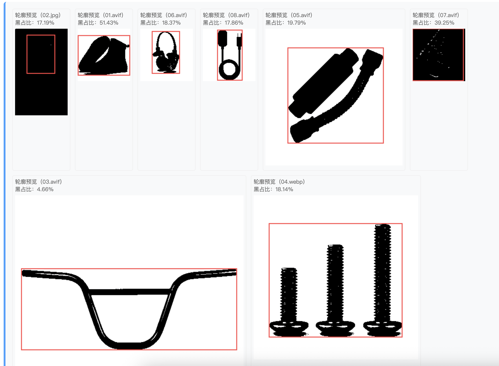
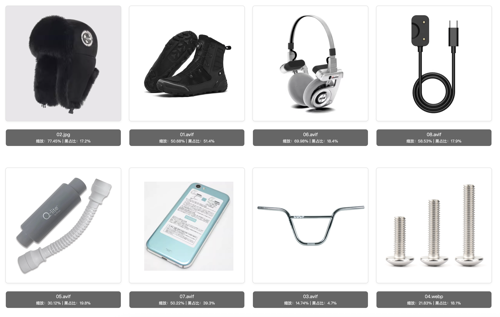

# Product List Image Layout Optimization
## Overview
This document outlines a technical solution to address inconsistent display issues of product images on the product list page, aiming to optimize the visual presentation of product images through JavaScript-based content recognition and CSS-driven layout adjustment.

[Online Demo Page](https://vitrum.github.io/product-list-image-auto-refit/)

## Problem Statement
On the product list page, images often display inconsistently due to variations in shooting timelines and sources—with some products appearing overly large in the frame and others excessively small—detracting from the visual experience for end users.

<!-- 图1：产品列表图片显示不协调示例
替换说明：将括号内的路径替换为实际图片路径（仓库相对路径/远程直链），可补充width属性调整尺寸，示例：

-->

## Proposed Solution
To address this issue, we propose leveraging JavaScript for image content recognition and CSS for dynamic layout adjustment, following the logic below:
1. **Image Content Recognition**: If a product image features a transparent or solid-color background with no text interference, use JavaScript to frame the product within the image and calculate the boundary values between the frame and the image edges.

2. **Layout Adjustment**: During front-end rendering, utilize CSS background image scaling and offset properties to adjust the product’s position within the display frame, ensuring a visually comfortable layout for all product images.

<!-- 图2：图片优化后显示效果/技术实现示意
替换说明：同上，可根据实际需求修改alt文本和图片路径
-->
